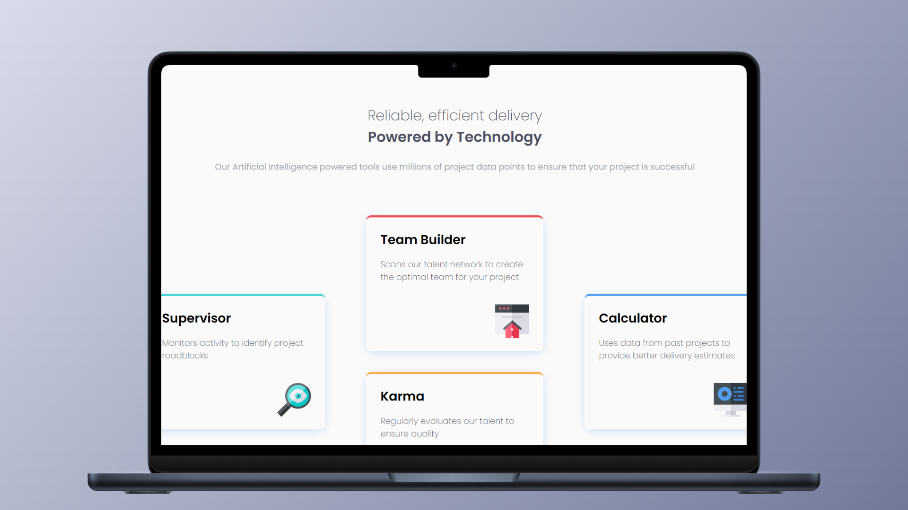

<h1 align="center">Four Card Feature Section 🚀</h1>

<p align="left">
  <a href="README_ES.md" target="_blank">
    View README in Spanish
  </a>
</p>

<p>This repository contains a solution for the Frontend Mentor "Four Card Feature Section" challenge. This project aims to practice and improve my skills in creating responsive, multi-column layouts using CSS Grid.</p>
<hr>

<h1 align="center">Technologies Used</h1>
<div align="center">
  
  
</div>
<hr>

<h1 align="center">Objective</h1>
<ul>
  <li>Improve my CSS Grid skills by creating complex, multi-column layouts.</li>
  <li>Design a responsive section adaptable to different screen sizes.</li>
  <li>Enhance semantic HTML structure and accessibility.</li>
</ul>
<hr>

<h1 align="center">Main Features</h1>
<ul>
  <li>Consistent and modern grid card layout.</li>
  <li>Responsive design for mobile, tablets, and desktops.</li>
  <li>Effective spacing and alignment of elements.</li>
</ul>
<hr>

<h1 align="center">Skills Acquired</h1>
<ul>
  <li>Proficiency in CSS Grid.</li>
  <li>Creating responsive and semantic UI components.</li>
  <li>Managing spacing and alignment efficiently.</li>
</ul>
<hr>

<h1 align="center">How to Use</h1>

1. Clone this repository to your local machine:
   ```sh
   git clone https://github.com/JordanMedinaOrtiz/four-card-feature-section.git
   cd four-card-feature-section
2. Open index.html in your browser.

<p>This challenge was a great opportunity to consolidate my knowledge of CSS Grid and responsive design — essential skills for frontend development.</p>
<p>You can view the live demonstration of the project <a href="https://jordanmedinaortiz.github.io/four-card-feature-section/" target="_blank">here</a>.</p>

